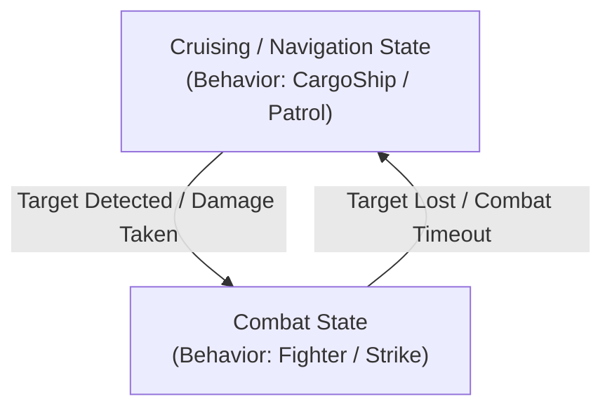

# AI Behaviors, Autopilot & Combat Systems

Architectural guide to RivalAI behavior trees, the 11 behavior subclasses, Enenra's Role vs. CombatType state machine, autopilot configurations, and squad command networks.

---

## 1. AI Behavior Subclasses

Every RivalAI behavior profile (`[RivalAI Behavior]`) assigns a `[BehaviorName:<Subclass>]` that dictates the grid's core flight and engagement model:

| Subclass | Flight & Combat Logic | Primary Environment | Default Fallback Autopilot Profile |
| :--- | :--- | :--- | :--- |
| **`Passive`** | Stationary or drift; non-navigating. Used for stations, derelicts, and static stores. | All | `RAI-Generic-Autopilot-Passive` |
| **`CargoShip`** | Flies straight between initial spawn and destination despawn waypoint. | Space / Planet | `RAI-Generic-Autopilot-CargoShip` |
| **`Escort`** | Holds a formation slot around a parent NPC. The parent's behavior lists the slots in `[EscortOffsets:]` and assigns them on escort request (`EscortSystem.cs`). Speed matching: §3C. | Space / Planet | `RAI-Generic-Autopilot-Escort` |
| **`Fighter`** | High-speed interceptor; performs strafing runs, breakaway loops, and evasive rolls. | Space / Planet | `RAI-Generic-Autopilot-Fighter` |
| **`FighterPlane`** | Atmospheric attack plane; continuous diving runs, fixed weapons, forward-velocity climbing breakaway. | Planet | `RAI-Generic-Autopilot-Strike` |
| **`HorseFighter`**| Hybrid standoff fighter; orbits target at weapon range, making rapid firing passes. | Space / Planet | `RAI-Generic-Autopilot-HorseFighter` |
| **`Horsefly`** | Standoff skirmisher; maintains distance, orbits target, and fires turreted weaponry. | Space / Planet | `RAI-Generic-Autopilot-Horsefly` |
| **`HorseNautical`**| Hybrid naval vessel; standoff aquatic skirmisher adhering to water line. | Planet (Water Mod) | `RAI-Generic-Autopilot-Horsefly` |
| **`Hunter`** | Relentless tracker; seeks out high-threat player grids across long distances. | Space / Planet | `RAI-Generic-Autopilot-Hunter` |
| **`Nautical`** | Water Mod naval vessel; adheres to buoyancy surface lines and aquatic pathing. | Planet (Water Mod) | `RAI-Generic-Autopilot-Nautical` |
| **`NauticalRoutes`**| Water Mod vessel following predefined aquatic shipping routes. | Planet (Water Mod) | `RAI-Generic-Autopilot-Nautical` |
| **`Patrol`** | Loops through a series of patrol waypoints; breaks off to engage on threat. | Space / Planet | `RAI-Generic-Autopilot-Patrol` |
| **`Scout`** | Reconnaissance craft; patrols waypoints, performs radar scans, calls reinforcements. | Space / Planet | `RAI-Generic-Autopilot-Scout` |
| **`Sniper`** | Extreme long-range artillery; maintains 2km–5km standoff distance with fixed weapons. | Space / Planet | `RAI-Generic-Autopilot-Sniper` |
| **`Strike`** | Heavy attack craft; approaches high, initiates high-speed diving run, breaks off. | Space / Planet | `RAI-Generic-Autopilot-Strike` |

> [!TIP]
> **Autopilot Fallback**: If an encounter does not define `[AutopilotData:<SubtypeId>]`, MES automatically falls back to `RAI-Generic-Autopilot-<BehaviorName>` (or `RAI-Generic-Autopilot-Strike` for `FighterPlane`). Defining custom autopilot profiles is always recommended for fine-tuned combat performance.

---

## 2. Dynamic Behavior Subclass & Autopilot State Switching

MES natively allows an NPC grid to transition between passive navigation and combat states using action tags. Modders can construct state machines using native RivalAI tags:



> [!NOTE]
> Some community mods (such as `mes-shared-behaviors`) use custom strings (`[CustomStrings:Role,...]` / `[CustomStrings:CombatType,...]`) as arbitrary variable names to track states. These are user-defined string conventions, **not** native MES tags. The actual engine mechanisms doing the work are the native tags below.

> **`[AutopilotProfile:]` takes a slot (`Primary`, `Secondary`, `Tertiary`), not a profile name** (`ActionReferenceProfile.cs:264`). The slots are filled by `[AutopilotData:]`, `[SecondaryAutopilotData:]` and `[TertiaryAutopilotData:]` on the behavior profile (`AutoPilotSystem.cs:401/421/441`). Each swap also re-activates the autopilot from the new profile's tags (see section 6D, and `aircraft_behaviors_and_tuning.md` section 2).

### State Switching Implementation:
- **Transitioning to Combat**:
  Trigger on `[Type:Damage]` or `[Type:TargetNear]`:
  ```xml
  [RivalAI Action]
  [ChangeBehaviorSubclass:true]
  [NewBehaviorSubclass:Fighter]
  [ChangeAutopilotProfile:true]
  [AutopilotProfile:Secondary]
  [EnableTriggerTags:InCombat]
  [DisableTriggerTags:Cruising]
  ```
- **Returning to Cruising / Navigation**:
  Trigger on `[Type:NoTargetCheck]` or combat timeout:
  ```xml
  [RivalAI Action]
  [ChangeBehaviorSubclass:true]
  [NewBehaviorSubclass:CargoShip]
  [ChangeAutopilotProfile:true]
  [AutopilotProfile:Primary]
  [EnableTriggerTags:Cruising]
  [DisableTriggerTags:InCombat]
  ```

---

## 3. Autopilot Deep Dive (`[RivalAI Autopilot]`)

### A. Collision Evasion & Planet Flight Rules
- `[UseVelocityCollisionEvasion:true]`: Uses velocity projection vectors to evade asteroids and terrain before impacts occur.
- `[CollisionEvasionWaypointCalculatedAwayFromEntity:true]`: Generates evasion waypoints away from the obstacle rather than toward target.
- `[FlyLevelWithGravity:true]` vs `[UseSurfaceHoverThrustMode:true]`:
  > [!CAUTION]
  > **Hard Conflict**: Never enable both. `FlyLevelWithGravity` aligns the grid's artificial horizon with gravity, while `UseSurfaceHoverThrustMode` forces downward thrusters to maintain a fixed terrain altitude. Combining them causes violent physics oscillation and sim-speed collapse.
- **Pitch Lockout Trap (`[FlyLevelWithGravity]` / `[LevelWithGravityWhenIdle]`) [HARD]**:
  > [!CAUTION]
  > **Pitch Lockout**: Never enable `[FlyLevelWithGravity:true]` or `[LevelWithGravityWhenIdle:true]` on craft that need to pitch their nose (aircraft, dive bombers, fixed-weapon gunships, snipers). In `RotationSystem.cs:187`, `LevelWithGravity` forces gyro pitch to align solely with the planetary horizon, completely bypassing target pitch. Furthermore, `[LevelWithGravityWhenIdle:true]` suffers from a state-bleed bug in `ActivateAutoPilot()` that permanently latches `LevelWithGravity` into combat modes across `FighterPlane`, `Strike`, `Sniper`, and `HorseFighter`. Details: §6.D.

### B. Combat Maneuvers & Firing Passes
- `[UseProjectileLeadPrediction:true]`: Calculates target angular velocity and projectile velocity to lead shots.
- `[AllowStrafing:true]`, `[StrafeMinDurationMs:3000]`, `[StrafeMaxDurationMs:6000]`: Lateral thruster bursts during combat.
- `[AttackRunDistancePlanet:600]`, `[AttackRunBreakawayDistance:100]` (autopilot profile tags): distance thresholds for `Strike`/`FighterPlane` attack runs and breakaways. The `[StrikeBeginPlanetAttackRunDistance:]` / `[StrikeBreakawayDistance:]` behavior-level tags are ignored whenever an autopilot profile is attached (`Strike.cs:22-25`), and `[AttackRunMaxTimeTrigger:]` has no parser at all. See `aircraft_behaviors_and_tuning.md` section 1.
- `[BarrelRollMinDurationMs:2000]`, `[BarrelRollMaxDurationMs:3000]`: Evasive corkscrew rolls when targeted by hostile lock.
- `[RamMinDurationMs:6000]`: Emergency kamikaze ramming maneuver when severely damaged.

### C. Speed & Altitude Clamping
- Speed restoration: Using `-1` in `[ChangeAutopilotSpeed:true]` + `[NewAutopilotSpeed:-1]` and `[ChangeAutopilotMinAltitude:true]` + `[NewAutopilotMinAltitude:-1]` cleanly restores the default autopilot values from the profile!
- **Escort speed matching** *(tags parsed since MES 2.74.04; before, they were ignored and the defaults always applied)* — `[RivalAI Autopilot]` tags for `Escort` behavior (`Escort.cs`):
  - `[EscortSpeedMatchMaxDistance:<double>]` (default `150`): within this distance of its escort waypoint, if the parent is slower than the escort's `IdealMaxSpeed`, the escort's max speed is capped to the parent's current speed.
  - `[EscortSpeedMatchMinDistance:<double>]` (default `25`): **[HARD] no effect.** MES computes a lerped speed from it but never uses the result.
  - `[EscortUsesRelativeDampening:bool]` (default `false`): once within 250 m of the parent, the escort dampens relative to the parent grid. Useful for convoy escorts that drift at speed.

---

## 4. Target Acquisition & Prioritization (`[RivalAI Target]`)

```xml
<EntityComponent xsi:type="MyObjectBuilder_InventoryComponentDefinition">
  <Id>
    <TypeId>Inventory</TypeId>
    <SubtypeId>ModPrefix-Target-CombatFighter</SubtypeId>
  </Id>
  <Description>
    [RivalAI Target]
    [UseCustomTargeting:true]
    [Target:PlayerAndBlock]
    [BlockTargets:Guns]
    [BlockTargets:Thrusters]
    [BlockTargets:Power]
    [GetTargetBy:ClosestDistance]
    [MaxDistance:4000]
    [MatchAllFilters:Relation]
    [MatchAllFilters:Powered]
    [MatchAllFilters:OutsideOfSafezone]
    [Relations:Enemy]
  </Description>
</EntityComponent>
```

- **[HARD] `[UseCustomTargeting:true]` is the master gate**: `TargetingSystem.cs:268` returns before any target acquisition when it is `false` (the default), so a Target profile without it never selects a target.
- **`[Target:]`** (`TargetTypeEnum`): `Player`, `Grid`, `Block`, `PlayerAndGrid`, `PlayerAndBlock`, `Coords`, `Entity`, `Override`. Default `None`.
- **`[BlockTargets:]`** (`BlockTypeEnum`, repeatable): with a `Block` target type, focuses fire on block categories such as `Guns`, `Turrets`, `Thrusters`, `Power`, `Gyros`, `Controllers`, `Antennas`, `JumpDrives`, `Shields`, `Production`.
- **`[GetTargetBy:]`**: `ClosestDistance` (default), `FurthestDistance`, `HighestTargetValue`, `LowestTargetValue`, `Random`.
- **`[MaxDistance:]`**: Default 12000 m.
- **`[MatchAllFilters:]` / `[MatchAnyFilters:]` / `[MatchNoneFilters:]`** (`TargetFilterEnum`):
  - `Relation`: Applies `[Relations:]` (`Enemy`, `Neutral`, `Friends`, `Faction`).
  - `Owner`: Applies `[Owners:]` (`Unowned`, `Player`, `NPC`).
  - `Powered`: Ignores unpowered floating wrecks.
  - `OutsideOfSafezone`: Prevents wasting ammunition against safezone shields.
  - Also `Altitude`, `Broadcasting`, `Faction`, `Gravity`, `LineOfSight`, `MovementScore`, `Name`, `PlayerControlled`, `PlayerKnownLocation`, `Shielded`, `Speed`, `Static`, `TargetValue`, `Underwater`, `AirDensity`, `GravityThrust`, `IgnoreStealthDrive`.
- There are no `[UsePriorities:]`, `[TargetRules:]` or `[TargetSubsystems:]` tags; MES ignores them.

---

## 5. Squad Command Networks & Parent-Child Logistics

RivalAI allows inter-grid communication using radio commands:

### A. Calling Reinforcements on Damage
1. **Damaged Grid (Caller)**:
   ```xml
   [RivalAI Action]
   [BroadcastCommandProfiles:true]
   [CommandProfileIds:ModPrefix-Command-RequestBackup]
   ```
2. **Command Profile**:
   ```xml
   [RivalAI Command]
   [CommandCode:CallReinforcements]
   [SingleRecipient:false]
   [SendWaypoint:true]
   [MatchSenderReceiverOwners:true]
   [Waypoint:ModPrefix-Waypoint-BackupLocation]
   ```
3. **Patrol Grid (Responder)**:
   Trigger of `[Type:CommandReceived]` with `[CommandReceiveCode:CallReinforcements]`:
   ```xml
   [RivalAI Action]
   [AddWaypointFromCommand:true]
   [ChangeBehaviorSubclass:true]
   [NewBehaviorSubclass:Fighter]
   [ChangeAutopilotProfile:true]
   [AutopilotProfile:Primary]
   ```

### B. Parent-Child Logistics (Enenra GFA Courier Pattern)
- A static station summons a dynamic courier grid (`[SingleRecipient:true]`, `[CommandCheckFromParent:true]`).
- Transmits landing coordinates via `[AddWaypointFromCommand:true]`.
- Courier approaches, reduces altitude (`NewAutopilotMinAltitude:15`), lands, resupplies stock, and retreats.

### C. Command Delivery Semantics (`TriggerSystem.cs` / `CommandHelper.cs`) [HARD]
- **Synchronous delivery**: with `[CommandDelayTicks:0]` (default) `CommandHelper.SendCommand` invokes every listener immediately, inside the sender's action. A receiver's reply is therefore delivered back to the sender *before the sender's action finishes*.
- **Action ordering trap**: within one `[RivalAI Action]`, `BroadcastCommandProfiles` runs before `EnableTriggers` (`ActionSystem.cs`). An action that sends a request and enables the reply listener in the same breath misses the reply, because it arrives while the listener is still disabled. Enable the listener from an earlier action or a separate timer.
- **`[AllowUniqueCommandCodeSenderOnly:true]` records while disabled**: `ProcessCommandReceiveTriggerWatcher` adds `senderEntityId + receiveCode` to `ReceivedCommandSenderCode` *before* it checks `UseTrigger` or whether the command code matches (only the command `Type` is checked first). A command that arrives while the trigger is disabled, or with a different code, still permanently blacklists that sender for that trigger (stored in the RC, survives reloads). Combined with the ordering trap above this can silently blacklist the intended replier. It can also be used on purpose: get one reply from a sender while the trigger is disabled to exclude it forever (e.g. "fly to any friendly base except the one that spawned me").
- **`[ReturnToSender:true]`** on a reply command sets `SingleRecipient` and targets the requesting Remote Control only.
- **`{FactionTag}` in `[CommandCode:]`** is replaced with the sender Remote Control owner's faction tag (`Command.PrepareCommand`), so one command profile can address faction-specific listeners (`[CommandReceiveCode:Request-GRAY]`). This is a separate replace from `IdsReplacer`; receive codes go through `IdsReplacer` instead.

---

## 6. Thruster Direction Requirements, FighterPlane & Rover Locomotion

RivalAI completely controls grid propulsion via direct override percentage injection (`Block.ThrustOverridePercentage`) on all registered thrusters (`ThrustSystem.cs` / `ThrusterProfile.cs`). This bypasses standard player flight inputs and creates hard directional dependencies.

### A. The 6-Direction Thruster Requirement [HARD]
Unless using a subclass specifically built for single-axis thrust (`FighterPlane`), **all space and hovering NPCs must have at least one working thruster in all six cardinal directions**. Omitting opposing, lateral, or vertical thrusters causes severe flight pathologies:

1. **The Active Braking Override Trap**:
   - In `ThrustSystem.CalculateDirectForwardThrust()`, whenever grid velocity exceeds target speed (`velocityAmount > MaxSpeed + MaxSpeedTolerance`), MES commands full reverse braking override:
     ```csharp
     _thrustToApply.SetZ(true, true, 1, _orientation); // ControlZ = true, InvertZ = true, Strength = 100%
     ```
   - In `ThrusterProfile.UpdateThrusterBlock()`, existing forward thrusters are forced to `0.0001f` override (killing forward thrust AND suppressing vanilla inertia dampeners).
   - Reverse thrusters are commanded to 100% override. If the grid has **no reverse thrusters**, braking force is `0`.
2. **Stopping Distance Blindspot**:
   - `ThrustSystem.CalculateStoppingDistance()` computes required stopping distance using `GetEffectiveThrustInDirection(baseBrakeDir)`.
   - With no reverse thrusters, available braking force is `0`, acceleration is `<= 0`, and calculated stopping distance is `0`.
   - The autopilot never throttles down when approaching waypoints and blows past them at full speed.
3. **The 180° Flip-and-Burn Slingshot Loop**:
   - Once past the waypoint, the waypoint is behind the craft.
   - `RotationSystem.CalculateGyroRotation()` turns the ship 180° to face the waypoint.
   - Because the nose now faces the waypoint while momentum carries the ship away at high speed, `velocityToTargetAngle` is ~180° (`> MaxVelocityAngleForSpeedControl`).
   - MES commands 100% forward thrust (`SetZ(true, false, 1)`). The ship accelerates forward to cancel velocity, overshoots again in the opposite direction, and enters an infinite oscillating slingshot into deep space.
4. **Strafing Failure (`Fighter` Subclass)**:
   - In `Fighter.cs`, engaging a target activates `NewAutoPilotMode.Strafe`.
   - `CalculateStrafeThrust()` randomly rolls X, Y, and Z strafe directions (`strafeRandomization = new Vector3I(Rnd.Next(-1, 2), ...)`).
   - Commands in directions lacking thrusters set opposing thrusters to `0.0001f` without applying corrective acceleration, throwing the craft into uncontrolled lateral drift.

---

### B. Single Forward Thruster Architecture (`FighterPlane`) [HARD & SOFT]
[`FighterPlane.cs`] is the sole RivalAI flight subclass engineered to operate with only forward-facing propulsion:

- **No Strafing Mode [HARD]**: `FighterPlane` never activates `NewAutoPilotMode.Strafe`. It uses only `RotateToWaypoint | ThrustForward | PlanetaryPathing | WaypointFromTarget`. All thrust is channeled through the nose.
- **Continuous Attack-Run State Machine [HARD]**: Unlike `Horsefly` or `Sniper`, it never comes to a hover stop. It runs an unbroken cycle: `ApproachTarget` -> `EngageTarget` (diving gun run) -> `Breakaway` -> `OffsetWaypoint` -> repeat.
- **Velocity-Aligned Breakaway & Climb (`keepInDirectionOfVelocity`) [HARD]**:
  - At `FighterPlaneBreakawayDistance`, it calls `CreateAndMoveToOffset(keepInDirectionOfVelocity: true)`.
  - In planetary gravity, `AutoPilotSystem.OffsetWaypointGenerator()` strips the vertical gravity component from `MyVelocity` and projects the breakaway waypoint **straight ahead along the plane's existing flight path**, elevated to `IdealPlanetAltitude` / `OffsetPlanetMinTargetAltitude`.
  - The aircraft fires fixed guns at the target during the dive, then pitches up into a climb straight through and over the target. It extends away at full speed without attempting to brake or flip 180°.
- **Planetary Recommendation (`FighterPlane` vs `Strike`) [SOFT]**: Consider testing `FighterPlane` over `Strike` for planet-only aircraft NPCs, even without aerodynamic surface mods. Standard vanilla thrust aircraft with forward-bias thrust may benefit from the velocity-aligned climbing breakaway (`keepInDirectionOfVelocity = true`), avoiding the sharp vector changes, skidding, and ground-pancaking inherent to `Strike`'s randomized offset selection.
- **Gravity Gate Limitation [HARD]**: In `AutoPilotSystem.cs`, `keepInDirectionOfVelocity` is gated by `if (InGravity())`. In space, offsets revert to random directions (`VectorHelper.RandomDirection()`). Single-thruster `FighterPlane` setups will fail in zero-G.
- **Gravity & Aerodynamics Dependency [SOFT]**: Space Engineers vanilla physics provides no aerodynamic lift. Single-thruster aircraft require sufficient pitch authority to generate vertical lift by angling forward thrust upward, or require an aerodynamics mod (e.g., Draygo's *Aerodynamic Physics*, *Plane Parts*).

---

### C. Thrust-Driven Rovers & Ground Vehicles (Best Practices & Pitfalls) [HARD & SOFT]

RivalAI does not drive `IMyMotorSuspension` wheel motors via the autopilot. Ground vehicles (`FakeRoverPathing` or standard behaviors) rely entirely on **thrusters for locomotion** and **gyroscopes for steering**. Ground rovers experience severe instability, stratospheric launches, and motion deadlocks without proper thruster architecture and specialized autopilot tuning.

#### 1. Locomotion & Thruster Architecture [HARD & SOFT]
- **No Native Wheel Propulsion [HARD]**: RivalAI has zero code driving wheel suspension propulsion or steering. All wheeled rovers require internal/hidden thrusters in all 6 directions and gyroscopes.
- **Up Thrusters (pointing DOWN) [HARD]**: When a rover is below its waypoint (`altitudeDist < 0`), MES applies vertical correction via `_thrustToApply.SetY(...)`. Without Up thrusters, `SetY` does nothing, and the rover pitches its nose up into the sky and fires main forward thrusters to climb, launching it into the air like a rocket. Up thrusters satisfy vertical delta adjustments without pitch escalation.
- **Down Thrusters (pointing UP) [HARD & SOFT]**: When cresting dunes or bouncing over rocks, upward velocity (`upVelocityAmt > 0`) requires downward braking. In `CalculateHoverThrust()`, `CalculateStoppingDistance()` computes downward braking using down thrusters. Without Down thrusters, downward stopping distance is `0`, and the autopilot cannot arrest upward bouncing. Down thrusters provide active bounce braking and continuous artificial downforce, keeping wheels planted for steering.
- **Forward & Backward Thrusters [HARD]**: Forward propulsion and waypoint deceleration. Reverse thrusters are mandatory; without them, `CalculateStoppingDistance()` is `0`, causing the rover to blow through waypoints at full speed.

#### 2. The Four Ground AI Failure Modes & Deadlocks [HARD]
1. **The Scalar Reverse Runaway Trap (`ThrustSystem.cs:250`)**:
   - Going downhill or hitting a terrain bump causes grid speed to exceed `MaxSpeed + MaxSpeedTolerance`.
   - In `CalculateDirectForwardThrust()`, MES commands `_thrustToApply.SetZ(true, true, 1)` (100% reverse override) and forces forward thrusters to `0.0001f` (disabling vanilla inertia dampeners).
   - Once the rover stops forward motion and rolls backward, MES checks `velocityAmount = velocity.Length()`.
   - Because `.Length()` is an **unsigned scalar**, reversing at 105 m/s still evaluates to `velocityAmount > MaxSpeed`. MES keeps 100% reverse thrust pinned permanently, accelerating the rover backwards into deep space.
2. **The Voxel Collision Sky Evasion Loop (`CollisionSystem.cs:1344`)**:
   - MES casts raycasts in cardinal directions. On a planet surface, forward and down rays immediately hit terrain voxels within meters.
   - In `CalculateEvadeCoords()`, MES iterates through available directions to find an unobstructed vector. The only clear direction with no voxels is **UP** (`UpResult`).
   - The autopilot generates evasion waypoints high in the sky, commanding climb thrust and pitch-up evasion constantly.
   - **Fix**: Set `[UseVelocityCollisionEvasion:false]` on all ground rovers.
3. **The 180° Backflip Bug (`RotationSystem.cs:103-120 & 179-200`)**:
   - When a waypoint or offset is generated behind the rover (~180°):
     - **Yaw Symmetry Deadzone**: `angleLeftToTarget` ≈ 90° and `angleRightToTarget` ≈ 90°. `YawTargetAngleResult` difference between left and right is nearly `0`, leaving yaw with almost zero directional authority.
     - **Pitch Saturation**: Any slight elevation delta or suspension tilt causes `CalculateGyroAxisRadians()` to evaluate `totalAngle = 180 > 0`, forcing `angleDifference = 90°` (`>= RotationSlowdownAngle`). This returns **100% maximum gyro pitch override** (`Math.PI * 2`).
     - Pitch is commanded to maximum torque while yaw is paralyzed. The rover attempts a **backflip into the sky** to turn around instead of yawing on the ground.
   - **Fix**: Set `[RotationMultiplierPitch:0.1]` and `[RotationMultiplierYaw:1.5]`. Keep `[RotationMultiplierRoll:1.0]` to preserve gyro authority for self-righting and defending against player ramming/flipping attacks.
4. **The 10° Hill Stall Trap (`ThrustSystem.cs:273, 409-416`)**:
   - In `CalculateHoverThrust()`, if rover chassis tilt exceeds `HoverUpAngle` (`upAngle > HoverUpAngle`):
     ```csharp
     _thrustToApply.SetY(false, false, 0, _orientation);
     _thrustToApply.SetZ(false, false, 0, _orientation); // Shuts off ALL forward thrust!
     ```
   - `HoverUpAngle` defaults to **`10` degrees** (`AutoPilotProfile.cs:320`). Standard SE ramps are 18.4° (3x1), 26.5° (2x1), and 45° (1x1).
   - Driving onto even shallow slopes or ramps causes `upAngle > 10`, immediately cutting forward thrust to 0% and stalling the rover permanently in `"Not Level With Gravity Direction"`.

#### 3. Slope Dynamics & The "3/4 Wheels in the Air" Conflict [HARD & SOFT]
- **The Gravity vs Terrain Normal Conflict**: `[FlyLevelWithGravity:true]` forces the rover chassis to remain perpendicular to the planet's gravity vector (`_upDirection`). On any hill or slope, the terrain normal is tilted relative to gravity. Forcing the chassis level lifts the uphill or downhill wheels into the air (balancing on 1 or 2 wheels).
- **The Solution**: Set `[FlyLevelWithGravity:false]`. This allows the suspension to sit flush on slopes naturally.
- **Remote Control Height Anchoring**: When `FlyLevelWithGravity:false`, the gyros aim the nose directly at the 3D position of the waypoint. In `CalculateHoverPath()`, the waypoint is placed at `_upDirection * IdealPlanetAltitude + stepAheadSurface`. If `IdealPlanetAltitude` is 10m or 25m, the waypoint floats in the air, causing the rover to drive with its front wheels pitched upward.
  - **Rule**: Set `[IdealPlanetAltitude]` to the **exact physical height of the Remote Control block above the ground** (typically `1.5` to `2.5` meters). This places the waypoint at bumper level, keeping pitch at ~0° parallel to terrain.

#### 4. Step Distance vs Waypoint Tolerance [CRITICAL]
- In `CalculateHoverPath()`, step-ahead waypoints are projected `HoverPathStepDistance` meters ahead.
- In `ThrustSystem.cs:442`, when `forwardDistance <= WaypointTolerance`, MES flags `"Within Waypoint Tolerance Distance"` and sets forward thrust to `0` (`SetZ(false, false, 0)`).
- **Rule**: `HoverPathStepDistance` **MUST ALWAYS BE GREATER** than `WaypointTolerance`!
  - If `HoverPathStepDistance <= WaypointTolerance` (e.g. Step 20m, Tolerance 25m), newly generated waypoints spawn inside the arrival radius, instantly zeroing forward thrust and deadlocking the rover.
  - Recommended: `[HoverPathStepDistance:50]` (use `< 100` for rough terrain) and `[WaypointTolerance:15]`.

#### 5. Prefab Wheel Suspension Tuning [SOFT]
- **Friction <= 12%**: Because RivalAI turns grids via gyroscopes rather than wheel steering angles, high tire friction (default 50%–100%) resists lateral skid. Set suspension friction very low (`<= 12%`) on the prefab to allow gyro yaw torque to pivot the vehicle smoothly without fighting tire grip or causing rollovers.

#### 6. Golden Rover Autopilot Configuration Template [REFERENCE]

```xml
<Description>
  [RivalAI Autopilot]

  <!-- Surface Navigation (Bypasses aircraft climb logic; uses directional velocity dot product) -->
  [UseSurfaceHoverThrustMode:true]

  <!-- Slope Alignment & Pitch Anchoring (Do NOT use FlyLevelWithGravity with UseSurfaceHoverThrustMode) -->
  [FlyLevelWithGravity:false]
  <!-- Set to exact physical height of Remote Control block above terrain (e.g., 1.5 to 2.5) -->
  [IdealPlanetAltitude:2]
  [MinimumPlanetAltitude:1]
  [AltitudeTolerance:1]

  <!-- Waypoint Projection (CRITICAL: StepDistance MUST be greater than WaypointTolerance) -->
  <!-- Use StepDistance < 100 for rougher terrains -->
  [HoverPathStepDistance:50]
  [WaypointTolerance:15]

  <!-- Vertical Stabilization & Anti-Rocket Clamping -->
  <!-- Caps climb rate when bouncing off dunes (default is -1 / unlimited) -->
  [MaxVerticalSpeed:5]

  <!-- Gyro Authority (Kills 180-deg backflips, prioritizes yaw, preserves roll self-righting) -->
  [RotationMultiplierPitch:0.1]
  [RotationMultiplierYaw:1.5]
  [RotationMultiplierRoll:1.0]

  <!-- Collision Evasion (Disable to stop rover evading ground voxels upward into space) -->
  [UseVelocityCollisionEvasion:false]

  <!-- Speed & Braking Tolerances (Prevents hill bumps from tripping 100% reverse brake trap) -->
  [MaxSpeedTolerance:5]
  [IdealMinSpeed:8]
  [IdealMaxSpeed:25]
</Description>
```

---

### D. Gravity Leveling & Pitch Lockout Hazards [HARD]

Setting artificial horizon leveling tags on combat craft causes total loss of pitch control, preventing grids from diving at ground targets or climbing toward waypoints:

1. **The `LevelWithGravityWhenIdle` State-Bleed Bug** (a second path: every `[ChangeAutopilotProfile]` swap runs `SetAutoPilotDataMode`, `ActionSystem.cs:1790` -> `AutoPilotSystem.cs:2370-2376`, which copies `LevelWithGravityWhenIdle` into the state and re-activates with default arguments, so the mode is also switched on by any profile swap):
   - In `AutoPilotSystem.ActivateAutoPilot()`:
     ```csharp
     if (useUserModeIdle != CheckEnum.Ignore)
         State.UseFlyLevelWithGravityIdle = (useUserModeIdle == CheckEnum.Yes);

     if (State.UseFlyLevelWithGravityIdle && Data.LevelWithGravityWhenIdle)
         CurrentMode |= NewAutoPilotMode.LevelWithGravity;
     ```
   - When an NPC spawns or loses targets, it enters `WaitingForTarget` (idle), calling `ActivateAutoPilot(..., NewAutoPilotMode.None, CheckEnum.No, CheckEnum.Yes)`. This sets `State.UseFlyLevelWithGravityIdle = true`.
   - In **`FighterPlane`** (line 192), **`Strike`** (line 192), **`Sniper`** (lines 106 & 142), and **`HorseFighter`** (line 153), the transition into `EngageTarget` calls `ActivateAutoPilot()` without passing `useUserModeIdle`, which defaults to `CheckEnum.Ignore`.
   - Because `Ignore` preserves the previous state, `State.UseFlyLevelWithGravityIdle` remains `true`. Line 889 **permanently forces `NewAutoPilotMode.LevelWithGravity` onto all subsequent combat attack runs**.

2. **The Gyro Pitch Clamping Mechanism (`RotationSystem.cs:187`)**:
   - Whenever `CurrentMode.HasFlag(NewAutoPilotMode.LevelWithGravity)` is active:
     ```csharp
     if (_upDirection != Vector3D.Zero && CurrentMode.HasFlag(NewAutoPilotMode.LevelWithGravity) && !CurrentMode.HasFlag(NewAutoPilotMode.Ram)) {
         PitchTargetAngleResult = VectorHelper.GetAngleBetweenDirections(referenceMatrix.Up, _upDirection) - VectorHelper.GetAngleBetweenDirections(referenceMatrix.Down, _upDirection);
         gyroRotation.X = (float)CalculateGyroAxisRadians(angleForwardToUp, angleBackwardToUp, PitchTargetAngleResult, gridSize, ref PitchAngleDifference);
     }
     ```
   - Pitch calculation (`gyroRotation.X`) aligns solely with gravity (`_upDirection`). **The code path calculating pitch to target/waypoint (`directionToTarget`) is completely skipped**.
   - The grid can yaw left and right towards waypoints, but its nose is permanently frozen flat against the planetary horizon. It cannot dive to fire fixed weapons, nor can it pitch up into a climb.

3. **Universal `[FlyLevelWithGravity:true]` Lockout**:
   - In the remaining subclasses (`Fighter`, `Horsefly`, `Scout`, `Hunter`, `Vulture`), moving modes pass `CheckEnum.Yes` for `useUserMode`.
   - If `[FlyLevelWithGravity:true]` is set in the profile, `LevelWithGravity` is actively commanded in all movement modes, producing the exact same pitch freeze.

4. **Golden Rule for NPC Combat Grids**:
   - For **any** craft that requires nose-pitch authority (aircraft, dive bombers, fixed-weapon gunships, snipers, attack drones):
     ```xml
     [FlyLevelWithGravity:false]
     [LevelWithGravityWhenIdle:false]
     ```
   - Reserve `LevelWithGravity` strictly for naval vessels (`Nautical`, `NauticalRoutes`), hovertanks, or broadside blimps with 100% turreted armament that never need to pitch.

---

## 7. Waypoint Profiles & the CargoShip Waypoint Queue

### A. `[RivalAI Waypoint]` Types (`WaypointProfile.cs`, `EncounterWaypoint.cs`) [HARD]
| `[Waypoint:]` | Stored as | Behavior |
| :--- | :--- | :--- |
| `Static` / `StaticRandom` | fixed world coords | `StaticRandom` randomizes around `[Coordinates:]`. |
| `EntityOffset` | fixed world coords | `[Coordinates:]` transformed by the entity's matrix **once**, at creation. |
| `EntityRandom` | fixed world coords | Random point around the entity's position **at creation**. Use with `[RelativeEntity:Self]` for random "wander" legs. |
| `RelativeOffset` | offset, re-applied on every read | `Vector3D.Transform(Offset, Entity.WorldMatrix)` in every `GetCoords()`: the point moves and rotates with the entity. |
| `RelativeRandom` | offset, re-applied on every read | Computes a **world-space** delta (random point minus entity center) but stores it as a `RelativeOffset`, which `GetCoords()` treats as **local** and pushes through the entity's current `WorldMatrix`. The point follows the entity (with `Self` it can never be reached), and its direction/altitude are rotated by the entity's orientation. Avoid; use `EntityRandom`. Upstream: [MES #321](https://github.com/MeridiusIX/Modular-Encounters-Systems/issues/321). |

- **[HARD] Random waypoints ignore the Water Mod**: `WaypointProfile.GetRandomCoords` (used by `StaticRandom`, `EntityRandom`, `RelativeRandom`) calls vanilla `planet.GetClosestSurfacePointGlobal` directly, so `[MinAltitude:]`/`[MaxAltitude:]` are measured from the **seabed**. Autopilot altitude (`PlanetEntity.SurfaceCoordsAtPosition`) *is* water-aware, and planetary pathing (`CalculateSafePlanetPathWaypoint`) lifts the pending waypoint so the grid still stays above the water. The arrival check, however, uses the raw point (see §7.B).

### B. `[BehaviorName:CargoShip]` Waypoint Queue (`CargoShip.cs`) [HARD]
- The queue is `AutoPilot.State.CargoShipWaypoints`, seeded from `[CustomWaypoints:]` at init. `[AddWaypoints:true]` + `[WaypointsToAdd:<WaypointProfile>,...]` appends (duplicates allowed), `[ClearAllWaypoints:true]` invalidates everything queued, `[AddWaypointFromCommand:true]` appends a command's waypoint. Within one action they run Clear -> Add -> AddFromCommand.
- **BehaviorTrigger flags**: `A` = a queued waypoint was reached. `B` = departed a waypoint. `C` = queue went empty -> non-empty. `D` = queue went non-empty -> empty (once per transition, **including right after spawn with no `[CustomWaypoints:]`**). With an empty queue the ship heads for its auto-generated despawn coords.
- **Procedural routes**: a `[Type:BehaviorTriggerD]` trigger with `[MaxActions:-1]` whose action adds one `EntityRandom`/`Self` waypoint gives a random walk that drifts away from the spawn point; each leg is generated from wherever the previous leg ended.
- **Arrival**: `Distance(RC, waypoint) < hypot(WaypointTolerance, WaypointTolerance)` against the **raw** waypoint, not the pathing-adjusted one. If pathing holds the grid well above a low (e.g. seabed-relative) waypoint, it never arrives. Raise `[WaypointTolerance:]` or the waypoint altitude.
- **`[WaypointWaitTimeTrigger:]` defaults to 5s**, and during the wait the autopilot runs with mode `None` (no thrust). Fine for ships; aircraft brake or stall mid-air. Set `[WaypointWaitTimeTrigger:0]` on aircraft autopilot profiles that use CargoShip.

---

## 8. Trigger Timer Persistence & Cooldown Re-Roll [HARD]
- **Cooldown re-rolls on every fire**: `InitRandomTimes()` only seeds the first `CooldownTime`; `ProcessTrigger` rolls a new one from `[MinCooldownMs:]`-`[MaxCooldownMs:]` each time the trigger fires (`TriggerSystem.cs`). A 45-60 min timer varies between 45 and 60 min every cycle.
- **Timers survive save/load**: each trigger's `CooldownTime`, `LastTriggerTime` (game time), `TriggerCount` and `UseTrigger` are serialized into the Remote Control's `Storage` (`StoredSettings`) and restored on load. Progress toward a long timer carries across sessions, so a 3-hour timer still fires even if every play session is shorter than 3 hours.
- The restored snapshot replaces the trigger list built from the `.sbc`, so trigger-field edits only reach grids spawned afterwards; Action/Condition/Spawner/Command/Chat profile contents are looked up by SubtypeId at runtime and do update.
